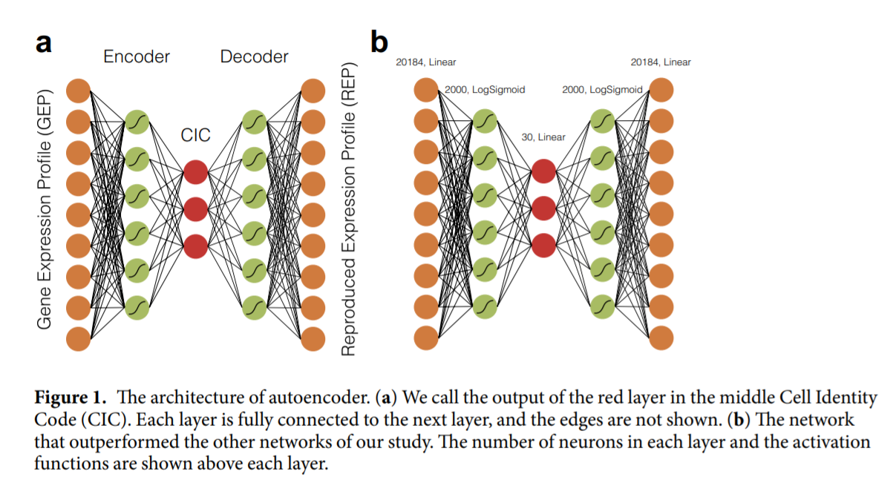
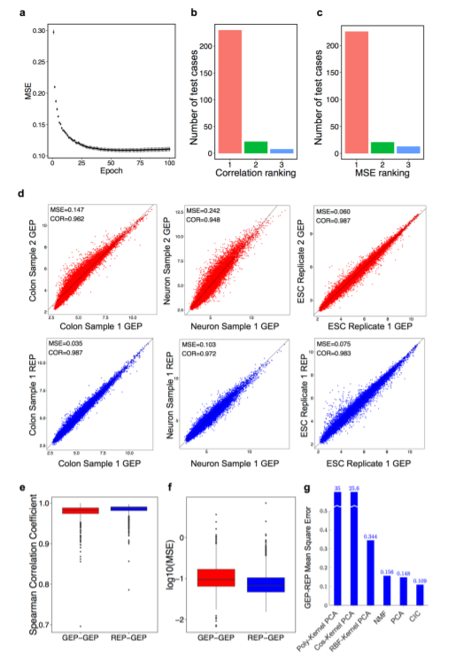
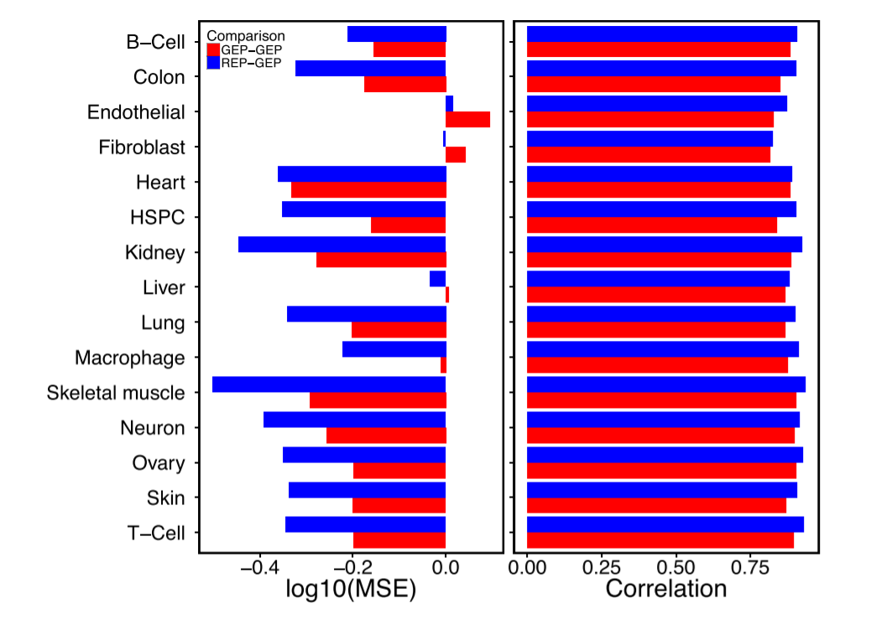
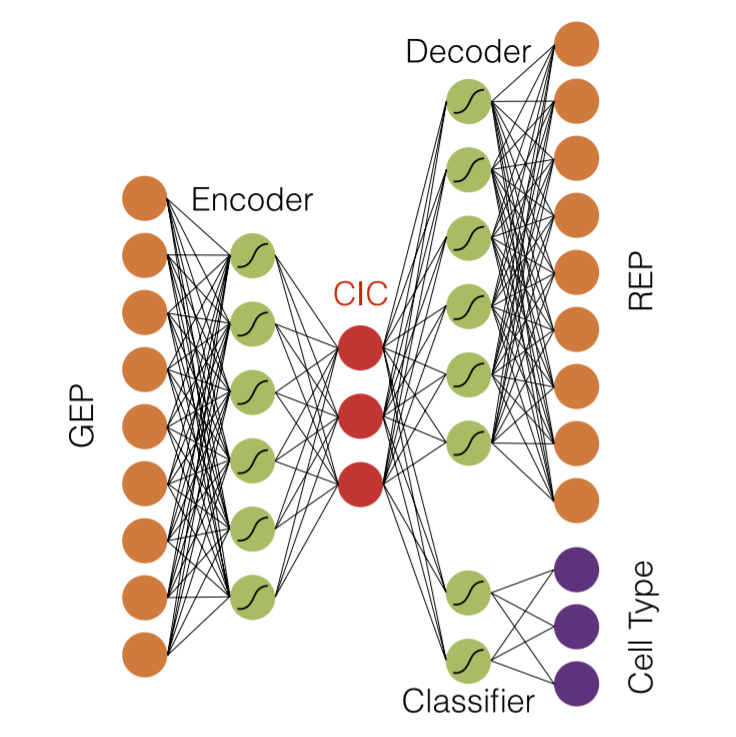
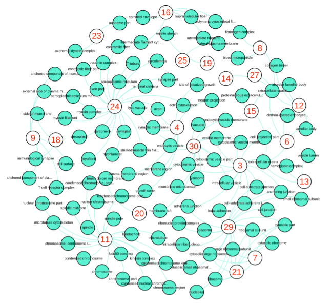
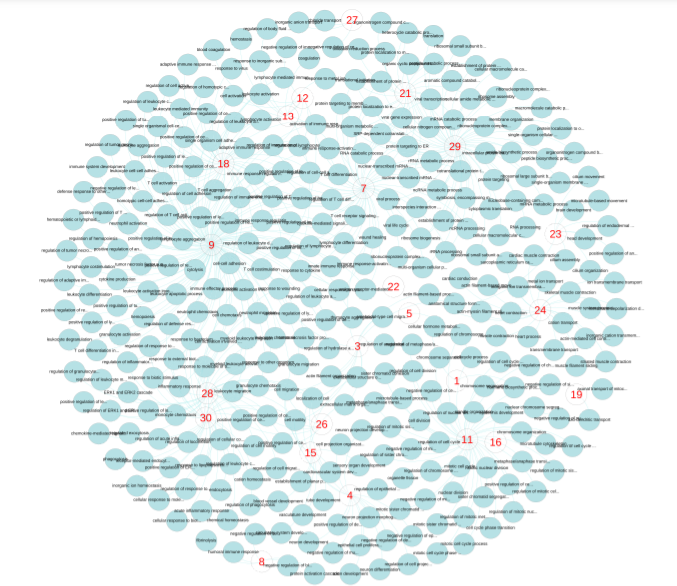
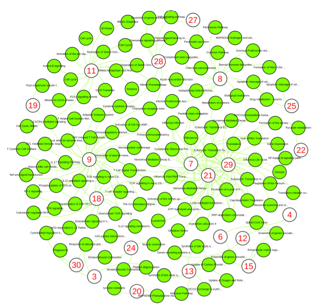
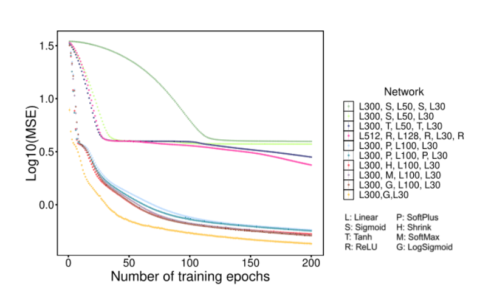

# ***Cell Identity Codes: Understanding Cell Identity fromo Gene Expression Profiles using Deep Neural Networks***

### by: Farzad Abdolhosseini, Behrooz Azarkhalili, Abbas Maazallahi, Aryan Kamal, Seyed Abolfazl Motahari, Ali Sharifi-Zarchi & Hamidreza Chitsaz

---

## **Abstract**
**Objective**: Use ML to to discriminate cell types based on the whole gene expression profiles (GEPs)

**Methodology**: used DNN to analyze 1040 GEPs from 16 different human tissues and cell types

**Discovery**: identified a specific structure of deep autoencoders that can encode a GEP into a vector of 30 numeric values called *cell identity code* (CIC)
- original GEP can be reproduced from the CIC with an accuracy comparable to technical replicates of the same experiment
- use unsupervised approach 
- found that different values of CIC connect to different biological aspects of the cell
- CIC can be used to reporduce the GEP of the cell types it has never seen during the training
- resist noise
- *classifier autoencoder*: architecture that cn accurately identify cell type based on the GEP or the CIC

## **Introduction**
- Marker genes is limited to specific cell types

- One possible solution: recognize cell identity using whole-genome gene expression profile (GEP)

- Few tools to classify arbitrarily large numbers of cell types with good accuracy => CellNet

**CellNet**: online tool that can analyze Microarray gene expression profiles of mouse or human and assign them to each of 16 humans or 20 mouse tissues or cell types
- min of 60 samples
- subnetworks of the union of these networks identified used a community detection algorithm called Infomap
- tissue specific subnetworks use Gene Set Enrichment Analysis (GSEA)
- expression levels of the genes belonging to teh tissue-specific subnetworks are then used to train a Random Forest binary classifier

Major issues with classic ML methods like SVM or Random Forest is the large number of genes differently expressed among different cell types

**Deep autoencoders**: group of deep neural networks that were orginally developed to learn dimensionality-reduction
- unsupervised
- reduce dimensionality
- perform additional tasks such as denoising the data

**Hypothesis**: dimensionality of GEPs can be significantly reduced using deep autoencoders
- make smaller features
- different aspects of cell biology
- cellular identity can be revealed by these features

## **Results and Discussion**
- obtained normalized expression profiles of 20184 genes in 1040 samples of 16 different human tissues and cell types fromo different datasets of NCBI GEO => collected and preprocessed in CellNet

- first task: determine a particular architecture of autoencoders that can accurately reproduce GEPs
    - tested 10 different farchitectures with distinct layer of configurations and activation functions
    - after selecting the best architecture => tested different sizes of the CIC layer and selected a particular architecture with 30 neurons in the CIC layer

### **Accuracy of Cell Identity Codes**
Test whether 2018-dimensional GEP vector can be accurately compressed in a 30-dimensional CIC, without losing data
- trained selected network architecture by 75% randomly selected samples as the training dataset and remaining 25% of the GEPs as the test dataset
    - test sample encoded to CIC and then decoded to a reproduced gene expression profile (REP)
    - distance between each REP and original GEP wwas measured by Mean Square Error (MSE)
    - observed a stable decreasing MSE trend during the training
- performed 10-fol CV with balanced sampling to avoid overfitting

Using Spearmen correlation coefficient: tried to determine how close each individual cells were to each other
- REP-GEP pairs better than GEP-GEP pairs

Tested their method against Principle Component Analysis, Non-negative Matrix Factorization (NMF), Polynomial-kernel PCA, Cosine-kernel PCA, and Radial Basis Function (RBF)-kernel PCA 
- CIC outperform other dimensionality reduction algorithms

**Spearman's Rank Correlation Coefficient**: measures the strength and direction of association between two ranked variables

### **Universality of Cell Identity Codes**
**Question**: see if autoencoders that is trained with CIC can be used for other cell types

Using CIC was able to distinguish targeted cell samples with other cell types

### **Cell Type Classification**

**Question**: if CIC can be used for characterization of samples

**Method**:
- trained RF and SVM with 75% of samples
- used PCA to reduce the dimension of original gene expression profiles 
- 25 misclassified on PCA transformation and 27 misclassified on SVM out of 260
- unlimited number of CICs generated from the same gene expression profile depending on the weights and parameters of a neural network
- incorporated additional layers to the network architecture to identify neural network parameters that could produce more easily classifiable cell identity codes
    - two encoders and output sequential subnetworks => 30 neurons in the middle => output has two branches, decoder and classifier
        - classifier contained at most one hidden layer followed by a non-linear SoftMax layer

- new architecture performed better with 10 misclassification (3.8%)

### **CIC Represents Aspects of Cell Biology**

**Question**: whether other aspects of cell biology can be determined with CIC like biological pathways, processes, and other important aspects of cell biology

**Method**: which subset of genes are most influenced by changing the i-th component of CIC
- used trained classifier autoencoder to compute values of the mean and standard deviation for all the 30 values in a CIC
- produced REP by feeding means as input of the decoder network
- add additional 30 mean values to decoder
    - round i => only changed the i-th component of means by adding 2 standard deviations to the means
- compared of output of decoder network to see the reproduced expression values of which genes are most increased, in comparison with the baseline REP 
    - determined 100 genes with the highest absolute change in REP after increasing value of the component
- used ToppCluster to analyze the pathway and Gene Ontology

**ToppCluster**: online tool for enrichment analysis of multiple gene sets

- used Bonferroni method
- analyzed compartments that were significantly analyzed

- different CIC components significantly affect certain aspects of a cell's biology

### **CIC Can Resist Noise**

- normalized
- 3-fol CV round
- randomly initialized before every round
- CIC is good against the presence of noise

## **Methods**
### **Microarray Data**

Differential expression analysis was performed using linear regression and Bayesian analysis of the R/Bioconductor package limma

### **Deep Neural Networks**

**Hypothesis**: information of GEP can be compressed in a significantly lower dimension, such that the whole GEP can be reproduced from the lower dimension data

Employ autoencoders for dimensionality reduction of the GEPs
- reduce cost

### **Comparison of Autoencoder Architectures**

Find the best architecture

**Method**:
- created 10 different architectures
- selected 1000 genes with teh highest variance of expression among all 1040 samples to speed up the training time and 30 code neurons
- ended with 1000 output neurons
- 75% randomly selected for training set and remaining 25% used for test set
- all had linear layer, logsigmoid layer, and then linear connection of 2000 neurons to a code layer of size 10 to 100 neurons

### **Architecture, Training and Testing the Networks**

Used optimal architecture:
- randomly selected training sample was fed into a neural network => weights updated with Stochastic Gradient Descent
- reduced learning rate during epoch
- used learning rate of .001 and .003

### **Transfer and Criterion Functions**

Used several formulas
- ReLU
- Sigmoid
- LogSigmoid
- Tanh
- SoftPlus
- SoftShrink
- CE-Loss

### **Implementation**

- 75% for training and 25% for test
- 10 fold CV
- each round of training started from scratch
- all round merged together by calculating the mean value and standard error
- ToppCluster => multi gene-list enrichment analysis
- R statistical language
- R/Bioconductor packages like ggplot2, parallel, datat.table, and plyr
- Gephi
- Lua
- Torch7
- GPU through CUDA library
- Linux server running Fedora 24

