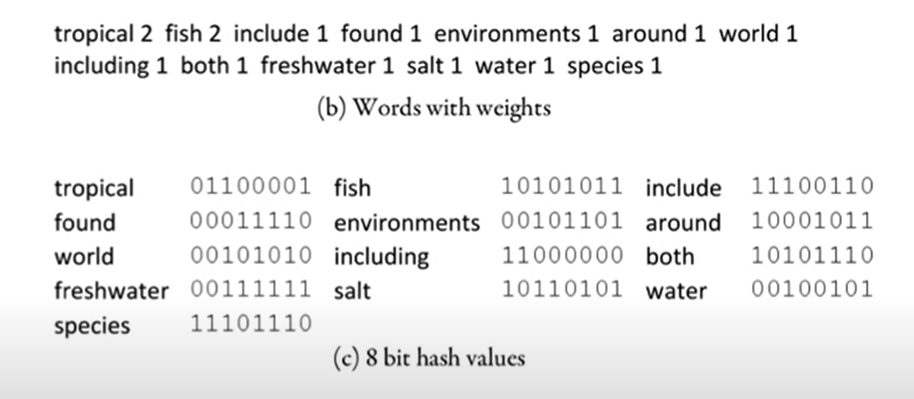
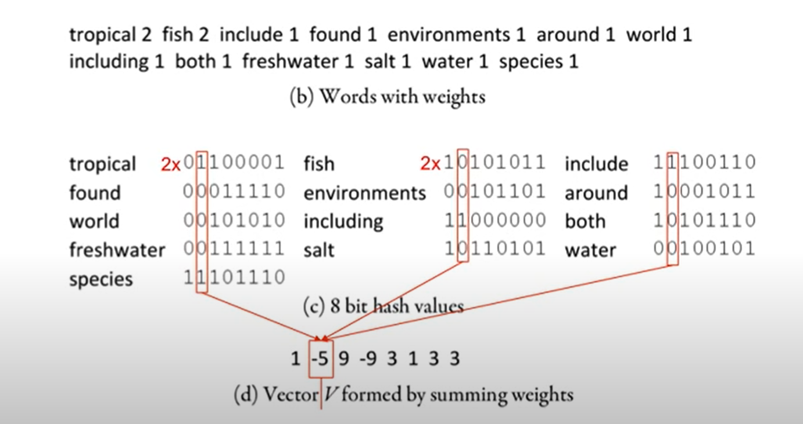
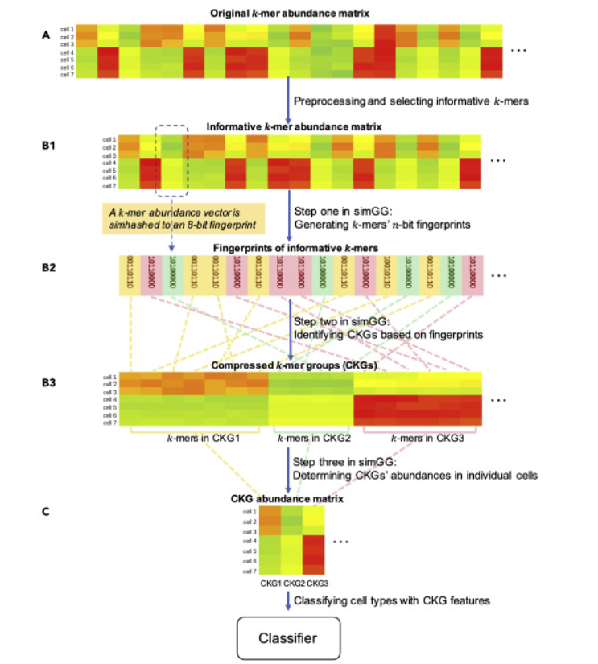
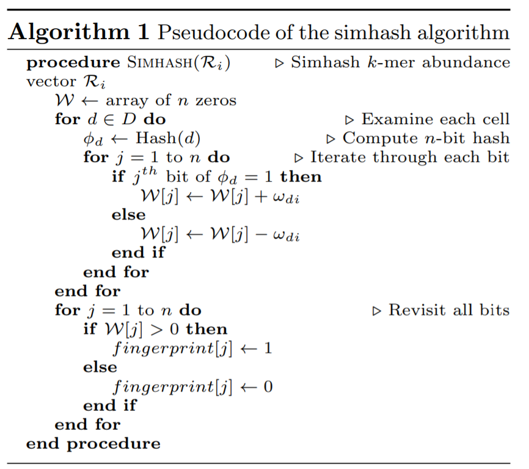
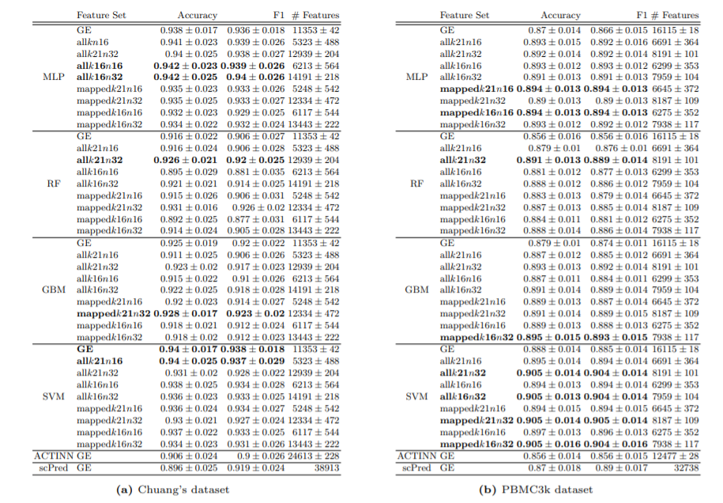

# ***A Reference-free Approach for Cell Type Classification with scRNA-seq***
### by: Qi Sun, Yifan Peng, and Jinze Liu

---

## **Abstract**
**Objective**: develop a way to overcome data sparsity and fully utilize original sequences

**Proposition**: scSimClassify - reference and alighnment free approach to classify cell types with *k*-mer level features derived from raw scRNA-seq experiment reads
- simhash method compressing *k*-mer with similar abundance profiles into groups
    - tokenize a document, remove non-content words
    - assign weights of words (typically frequency)
    - compute a b-bit binary hash code for every word
    - convert 0 -> -1 and multiply by word weight
    - add by columns
    - see if the sum is greater than or less than 0; assign final bit as 1 if positive, 0 otherwise

1010111

- compressed *k*-mer groups (CKGs) serve as aggregated *k*-mer level features for cell type classification

**Method**: evaluated performance of CKG features in four scRNA-seq datasets comparing fourstate-of-the-art classification methods as well as two scRNA-seq specific algorithms
- demonstrates that CKG features lend themselves to better performance than traditional gene expression freatures in scRNA-seq classification accuracy 
    - CKG features can be efficiently derived from raw reads without a resource-intensive alignment process

## **Introduction**
Problem with various ML algorithms
- highly sparse gene expression across all cells
- half of reads are thrown out
- time consuming

Approach
- reference-free approach for cell type classification
- explores novel features dervied from the entirety of the reads
- use *k*-mers (genomic words) as features along with their frequencies
- words associated with its own "frequency" or abundance

Advantages of scSimClassify
- reduces orginal *k*-mer feature space
- accurate
- top-ranked CKG features are biologically meaningful in consistency with gene expression features
- first reference-free method for multi-class cell type classification

## **Methods**
Reduce size of input
- simhash-based group generator in three steps:
    1. generate *k*-mers fingerprints
    2. group similar *k*-mers into a CKG
    3. determine CKG abundance matrix

**Simhash-based Group Generator (simGG)**

Utilized the locality sensitive hashing (LSH): approximate algorithm that is applicable to objects on a large scale, to detect similar *k*-mers

Simhash Method Steps:
1. generate *k*-mers' *n*-bit fingerprints
    - generates *n*-fingerprint by determining point's relative location among *n* generated hyperplanes => each bit corresponds to a hyperplane; otherwise, set to 0
    - larger *n* results in a more accurate similarity estimation for *k*-mer abundance vectors
    

2. identify compressed *k*-mer groups (CKGs)
    - two *k*-mers are considered simiilar if the Hamming distance between corresponding fingerprints is very small
    - used 0 as threshold
    - simhashes informative *k*-mer abundance vectors to *n*-bit fingerprints followed by identification of the *k*-mers with the same fingerprints through sorting (parallel computing)

3. determine CKGs' abundances in individual cells
    - pre-built CKGs from training set used to aggregate *k*-mer abundances into CKGs' abundances for both training and test sets
    - compress *k*-mer abundances into single abundances to represent the expression of a CKG in a cell
    - first filter out outliers whose abundances fall outside of two standard deviations fromm the mean abundance and then average the abundances of the remaining *k*-mers as the abundance

Classification Algorithms

- random forest
- gradient boosting machine
- multilayer perceptron
- support vector machine

## **Experimentation and Evaluations**

Compared CKG with commonly used gene expression through RF, GBM, MLP, and SVM
- used specifically ACTINN and scPrd because they worked the best

Datasets: Chuang [24], Karaayvaz [25], PMBC3k [26], and Lee [27]
Features: used gene expression data from GEO or 10X Genomics

Used scikit-learn library for RF, GBM, and SVM and Keras for MLP
Calculated F1 score for performance

### Comparing between GE and CKG features
used Chuang's and PBMC3k dataset
- CKG feature classified with MLP for Chuang's dataset
- CKG feature calssifed on PBMC3k classified by SVM
- all general purpose classifers in scSimClassify outperform scRNA-seq specific classifier ACTINN and scPred
- CKG features improved overall classification over GE features

### Evaluation of CKG feature variations
Varied CKG
- *k*
    - fixing the size of fingerpritns, classifiers, and read types, 21-mer
- *n*
    - 32-bit fingerprints better than 16-bit fingerprints
- *read types*
    - reference-free approach is better

Tried Inter-Dataset Classification
- Chuang's dataset as training datat for Karaayvazr's dataset
- PBMC identified based on PBMC3k

## **Discussion and Conclusion**

CKG genes are competitive for a dataset
- withotu specific gene annotations => can be discriminative for cell types

## **Resources**
[scSimClassify Github](https://github.com/digi2002/scSimClassify)

[SimHash Algorithm Paper](https://www.cs.princeton.edu/courses/archive/spr04/cos598B/bib/CharikarEstim.pdf)