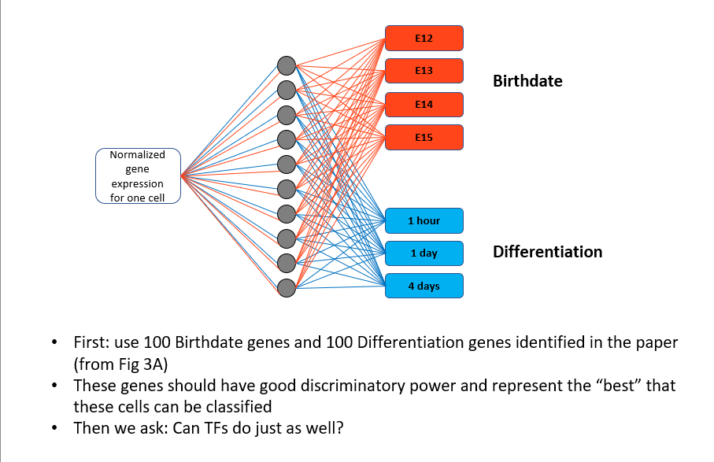
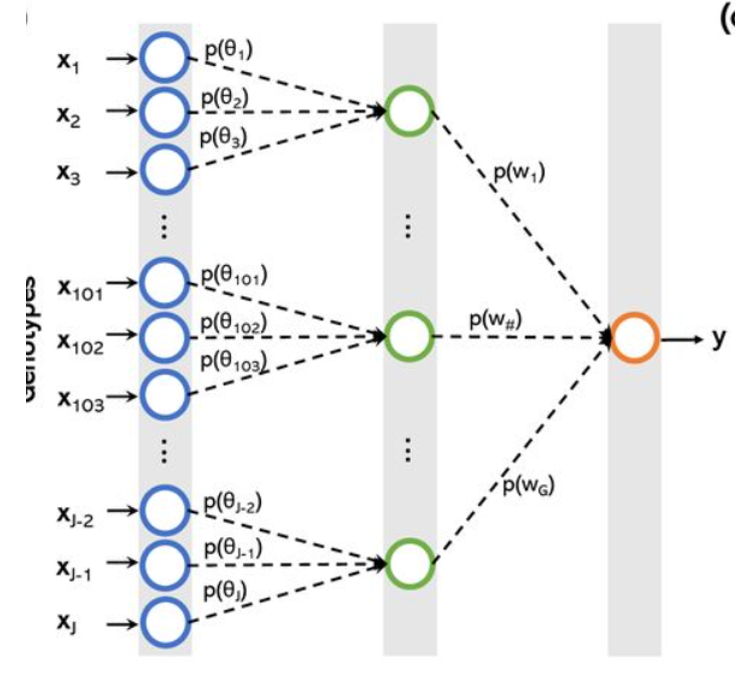

# ***Brain Cell Discrimination Using ANN***

**Question**: 
- Are all brain cells the same?
- Which genes and how they involve in brain cell specification?

**Projects**:
- Folate related brain development
- Egr1 related brain development

## **Marker Gene Identification Using Seurat**

Identification of all markers for each cluster:
- Use clustering to differentiate between different gene types

Identification of Conserved Markers for each Cluster
- identify differentially expressed genes within each condition => report those genes that are conserved in the cluster across all conditions

Marker Identification between Specific Clusters
- Find differentially expressed genes in different clusters

Parameters
- fold change
- percent difference in cells detected
- minimum percentage of cells detected  in each cluster

**Objective**: obtain a list of transcription factor (TF) genes and cells and the relationship between them and understand how to cluster the TF into groups

**Features**: 
- average of expression levels in cells detected
- coefficient of variation (CV) of expression in cells detected
- percentage of cells detected
- Determination
    - top 5% of the level average expression in cells detected 
    - bottom 5% of the CV of expression in cells detected

**Assumption**: asssume 20,000 genes with expression detected in a given scRNA-seq dataset => 20,000 x 5% x 5% = 50 genes   

## **ANN - Developing Brain**

**Science Paper**: *Temporal Patterning for Apical Progenitors and their Daughter Neurons in the Developing Neocortex*

Could use *100 birthdate genes* and *100 differentiation genes* (1 hr/1 day/4 days)
- good discriminatory power
- about 90% accuracy

Prediction with 905 Transcription Factor
- 905 out of the 1289 TFs recovered from in scRNA-seq
- 905 TF x 2756 cell matrix

Classify cells into birthdate and differentiation stage

Attempts:
- all 905 TFs in a single hidden layer
    - Birthdate: 38% accuracy 
    - Differentiation: 93% accuracy

TFs in transcriptional map clusters
- identified 12 clusters of genes that vary in two dimensions
- assigned TF to each of the clusters based on correlations provided by authors
- classified all cells using each of these clusters in 12 different ANN
- architecture => similar except with a single cluster of TF genes in 10 nodes in the network
    - smaller version of our ANN

## **ANN - Partially Connected**

**Objective**: 
- decide upon architecture
- ANN with R
- set up and run a partially connected neural network

**Architecture**: partially connected ANN creates a unifed framework for understanding biological traits

**Library**
- tensorflow, keras

**Future Direction**
- finalize a way to identify and group markder genes
- apply approaches to all scRNA-seq
- integrate groups of TF from different studies
- compare full and partial ANN

## **ANN - Neuron Activation**
**Science Paper**: *Single-cell analysis of experience-dependent transcriptomic states in the mouse visual cortex*

**Design**:
- analysis of neuron activation data using ANN
- split whole scRNA-seq to 2 datasets
    - training
        - determine weights and biases
    - test  
        - assess accuracy of program

## **Vocabulary**

**Folate or Folic Acic**: vitamin that can treat certain types of anemia; helps make healthy red blood cells
- without it can make abnormally large red blood cells that do not work properly

**RNA (ribonucleic acid)**: acts as a messenger carrying instructions from DNA for controlling the sythesis of proteins

**Transcription**: process of making an RNA copy of a gene sequence; uses DNA as a template to make RNA molecules
- **initiation**
- **elongation**
- **termination**

**Transcription Factors**: proteins involved in the process of converting, or transcribing, DNA into RNA

**gene expression**: a gene in DNA is "turned on" to make a specific protein

**marker gene**: gene used to determine if a nucleic acid sequence has been successfully inserted into an organism's DNA

### **Genes**

**EGR1 (Early Growth Response 1)**: protein coding gene; important transcription factor in memory formation

